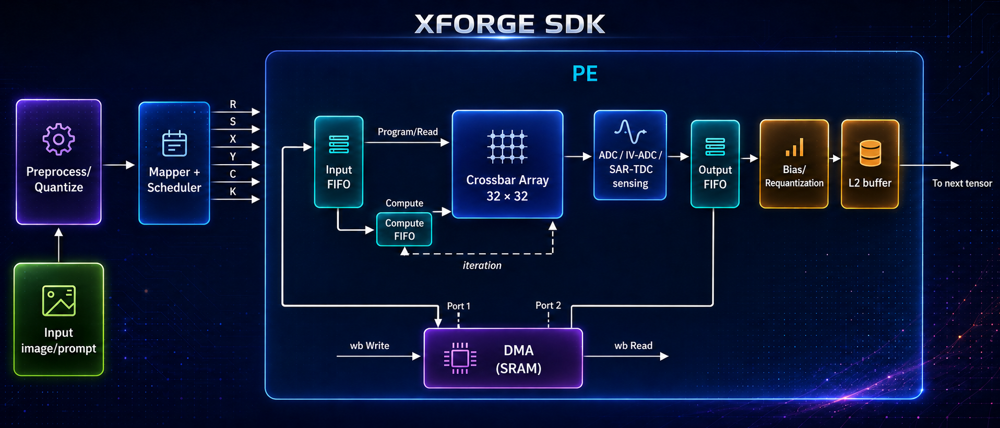
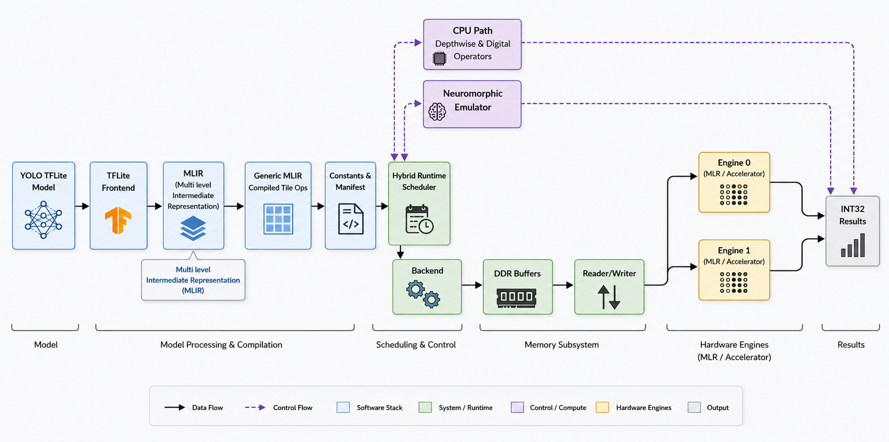

# XForge SDK 🧠💻

XForge SDK is a specialized Python library for simulating the execution of Deep Learning models (like YOLO) on **Neuromorphic X2** hardware. It provides tools for image preprocessing, neural network weight binarization, and hardware performance benchmarking.

---

## XForge SDK Architecture



### Compiler Dataflow



The XForge SDK follows a 32 x 32 crossbar PE view. Input image or prompt data is
preprocessed and quantized, then the mapper and scheduler emit the loop
dimensions `R/S/X/Y/C/K` into the PE. Inside the PE, data flows through the
input FIFO, compute FIFO, 32 x 32 crossbar array, ADC / IV-ADC / SAR-TDC sensing
block, output FIFO, bias/requantization stage, and L2 buffer before moving to
the next tensor.

| Block | SDK setting |
|---|---:|
| L2 buffer size | 512 KB |
| Input FIFO | 32-bit width, 32-entry depth |
| Output FIFO | 32-bit width, 32-entry depth |
| Compute FIFO | 8-bit width, 32-entry depth |
| Crossbar array | 32 x 32 INT8 array |

The input and output FIFOs use 32-bit paths for tensor movement, while the
compute FIFO uses an 8-bit data path with 32-entry depth for the values consumed
by the crossbar. Because signed weights must be represented on an analog
crossbar, the PE uses a column-differential strategy: each signed logical column
is split into positive and negative branches, both branches are sensed, and the
signed result is reconstructed by subtracting the negative branch from the
positive branch.

The DMA SRAM path is used for parallelism. DMA writeback and readback let PE data
movement run alongside compute, so Wishbone transactions do not slow the flow of
processed data through the pipeline.

---

## 🛠 Installation

Install the latest version:

```bash
pip install XForgeSDK==0.1.2
```

## 📖 Quick Start


```python
import streamlit as st
import numpy as np
from XForge_SDK import NeuromorphicSimulator, ImageProcessor, YOLOWrapper

# Page Config
st.set_page_config(page_title="XForge SDK Dashboard", layout="wide")

# 1. Initialize SDK Components
# These replace the manual logic previously scattered in app.py and user.py
@st.cache_resource
def init_sdk():
    return {
        "sim": NeuromorphicSimulator(num_pes=64),
        "processor": ImageProcessor(),
        "yolo": YOLOWrapper('yolon26n.pt')
    }

sdk = init_sdk()

st.title("🎯 YOLO26N: Neuromorphic Analysis SDK")
st.markdown("---")

uploaded_file = st.file_uploader("Upload Image", type=["jpg", "png"])

if uploaded_file:
    # 2. Use ImageProcessor for standardized loading
    img_array, channels = sdk["processor"].load_rgb_image(uploaded_file)
    
    col1, col2 = st.columns([2, 1])
    
    with col1:
        st.subheader("Object Detection")
        results = sdk["yolo"].predict(img_array)
        st.image(results[0].plot(), caption="Detection Results")
        
```


## 🧪 Development & Testing

Run the test suite after installation:

If using the Streamlit Dashboard:

```bash
streamlit run app.py
```

---

## 🤝 Contributing

For internal use by **BM Labs**. Please ensure all hardware-specific logic is validated against the NeuromorphicX2 core modules before pushing updates.
